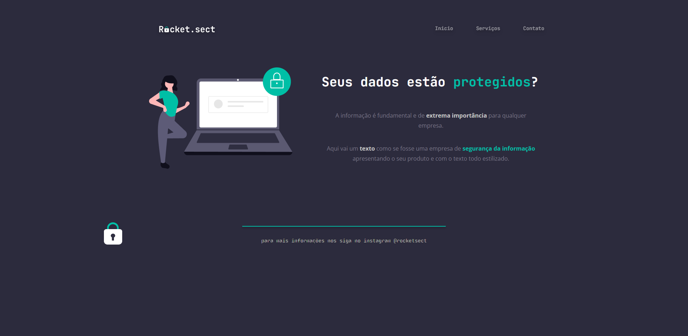

# Rocket.Sect

>Curso Explorer

Projeto construido solo através do figma no curso Explorer Rocketseat turma 06

[🔗Clique aqui para acessar](https://benedirgomesneto.github.io/RocketSect/)

## 🛠 Tecnologias

- HTML
- CSS
- Git e Github
- figma

## Desafio

Desafio proposto após a conclusão do projeto 2 executado em aula.
O desafio era realizarmos a execução de uma pagina fictícia através dos dados fornecidos no figma.

[Link Figma](https://www.figma.com/file/tbuHTFVydiHwjncTNN3rZv/Explorer-(Copy)?node-id=0%3A)

## 💛 Contato

benedirgomesneto@gmail.com
